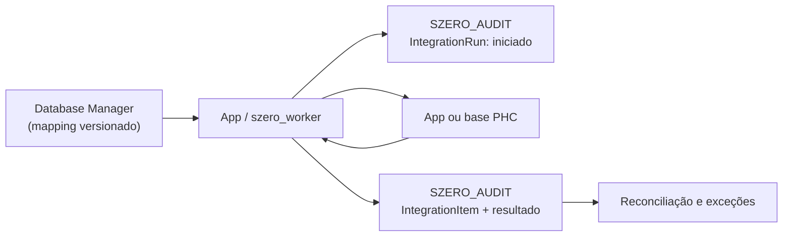

# Auditoria de integrações StationZero

## Estado

A base `GR360_LOG` e as tabelas `dbo.LOGAPP` e `dbo.LOGSYNC` foram criadas e validadas em 11-08-2026. O script idempotente está em [`migrations/gr360_log.sql`](../migrations/gr360_log.sql).

## Objetivo

Criar uma base de dados separada — proposta: `SZERO_AUDIT` — que registe de forma central e imutável tudo o que a aplicação e os `szero_workers` sincronizam entre a app e as bases PHC.

Não substitui o Database Manager: este continua a definir **o que** sincronizar. A auditoria passa a explicar **quando, por quem, em que direção, com que dados e com que resultado**.

## O que falta hoje

Os mappings guardam a configuração de tabela, campos, chaves e direção. O fluxo de obras já possui uma fila técnica `GR360_SYNC_QUEUE`, com operação, chave, estado, tentativas e último erro; é uma boa base de entrega, mas não é uma auditoria transversal. Falta o histórico de:

- execuções por worker ou utilizador;
- registos inseridos, atualizados, ignorados ou falhados;
- chaves e campos alterados;
- versão exata do mapping usada em cada lote;
- checkpoint incremental e reconciliação de origem versus destino.

## Modelo mínimo

| Entidade | Uma linha representa | Campos essenciais |
| --- | --- | --- |
| `IntegrationRun` | Uma execução de um mapping | `run_id`, `correlation_id`, `mappingstamp`, snapshot do mapping, worker/utilizador, direção, empresa, origem, destino, início/fim, estado e totais. |
| `IntegrationItem` | Um registo tratado no lote | `run_id`, sequência, chave de negócio, ação (`insert`, `update`, `skip`, `error`), hash antes/depois, campos alterados, motivo, erro e datas. |
| `IntegrationCheckpoint` | Posição segura de leitura | mapping + empresa + direção, watermark/versão e último `run_id` concluído. |
| `IntegrationReconciliation` | Resultado agregado de controlo | período, mapping, empresa, contagens e totais app/PHC, diferenças e estado de resolução. |
| `IntegrationEvent` | Eventos técnicos append-only | início, tentativa, reprocessamento, conflito, sucesso, falha e operador. |

Os valores completos podem ser guardados em JSON só quando necessário. Por defeito, guardar chaves, campos alterados e hashes evita duplicar dados pessoais e financeiros sem perder rastreabilidade.

## Fluxo operacional

1. O worker lê o mapping e cria um `IntegrationRun`, incluindo o snapshot da configuração.
2. Para cada registo, cria um `IntegrationItem` com a chave e hash de origem antes de escrever.
3. Atualiza o item com o resultado no destino e os campos efetivamente alterados.
4. Só avança o `IntegrationCheckpoint` depois de o lote terminar com sucesso.
5. A reconciliação compara, por empresa e período, contagens e valores dos dois lados.

## Regras importantes

- A app e todos os workers usam o mesmo `correlation_id`; uma execução manual fica tão auditada como uma automática.
- Os mappings bidirecionais, começando por `CL`, exigem uma regra explícita de conflito.
- O log é append-only para o escritor de integração; só um processo de retenção autorizado pode anonimizar ou arquivar dados antigos.
- A indisponibilidade da auditoria deve bloquear escritas de sincronização. É preferível atrasar um lote a ter alterações sem rasto.
- O log técnico não deve depender de triggers PHC: triggers não conhecem o `mappingstamp`, a direção, o worker nem a intenção de negócio.

## Ordem de implementação

1. Instrumentar a execução atual do Database Manager para `CL`, `OPC` e `VA`.
2. Aplicar o mesmo contrato ao `phc_table_sync_monitor` e aos restantes `szero_workers`.
3. Definir redaction de campos sensíveis antes de escrever `LOGAPP` ou `LOGSYNC`.
4. Adicionar checkpoints e a primeira reconciliação: `OPC`, `CL` por empresa e `VA` contra `GR360_SYNC_VA_SOURCE`.
5. Expandir para `FL` e `ST` depois da respetiva sincronização estar estabilizada.
